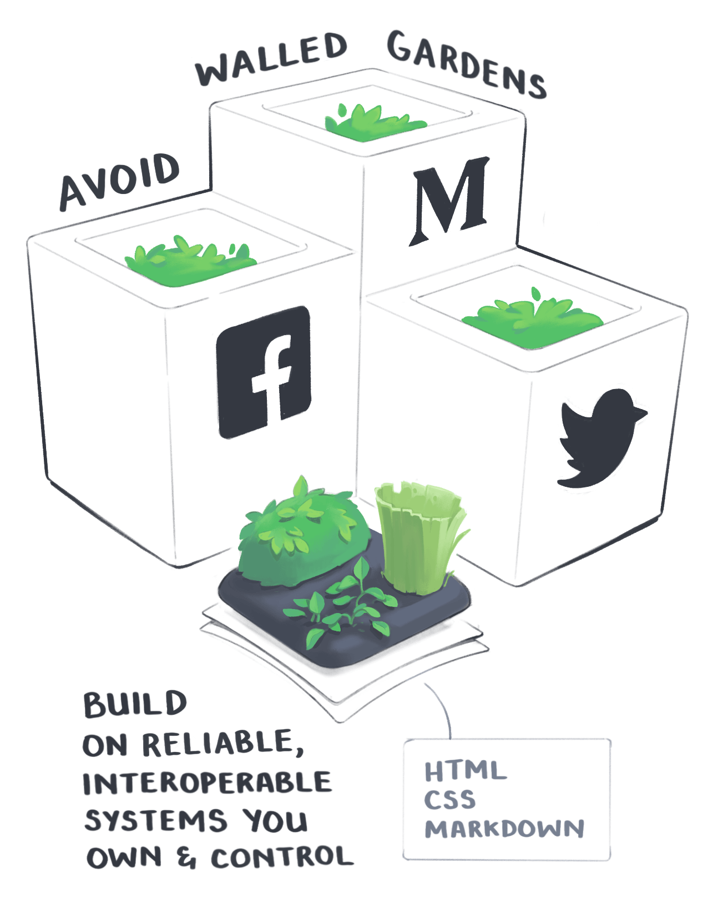

# my-patch-of-the-web

Claiming a small patch of the web for myself. Hopefully this will be the home of my personal website. Very much inspired by the concept of digital garden, as seen in [Maggie Appleton texts](https://maggieappleton.com/garden-history).

Borda de 2px? 4px (dá um efeito legal nas cores do Santuário)?

### Inspirations

https://www.behance.net/gallery/117432271/Marco-Polo-Festivals-Web

Santuário

# ideias

Será que vale a pena armazenar as posições e aí usar gsap para mover?
